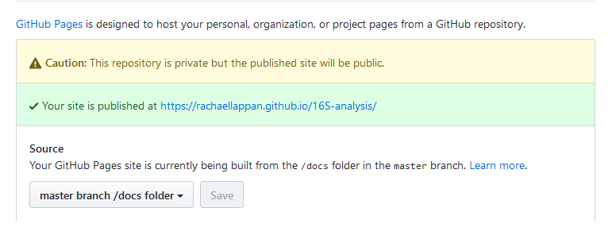

In my [last blog post](https://rachaellappan.github.io/rmarkdown/), I described how I use R Markdown as a tool in my research to document the analyses I do. I find this very useful to keep a record of the mass of troubleshooting and trial and error I do when I start a new analysis, but when it comes to having a neat record of the final pipeline for someone else to read (and hopefully understand) I needed to create something tidier.

I came across [Bookdown](https://bookdown.org/yihui/bookdown/) by [Yihui Xie](https://twitter.com/xieyihui), an R package that turns R Markdown documents into a neatly indexed book. Some nice examples of Bookdown books include the [book](https://bookdown.org/yihui/bookdown/) about writing books with Bookdown (yes), Tim Stuart's [lab notebook](http://timoast.github.io/2017/04/03/comp-notebook/) which I mentioned in my last post and the [vignette](http://rlbarter.github.io/superheat/index.html) for Superheat, a fantastic R package for heatmaps from [Rebecca Barter](https://twitter.com/rlbarter).

My first attempt at using Bookdown for neat documentation can be found [here](https://rachaellappan.github.io/16S-analysis/), where I recorded all of the analysis I did for our 16S rRNA amplicon dataset (paper currently under review). I found it useful both as a way of keeping a good record that I can easily refer to later, and to show other people exactly how I did the analysis in far more detail than the methods section of a paper would allow.

So, I thought I'd write a post on how I have used and hosted a Bookdown book on GitHub. I assume that RStudio is installed for making R Markdown documents - see my previous [post](https://rachaellappan.github.io/rmarkdown/).

### 1. Installing and using Bookdown

I followed Sean Kross' [tutorial](http://seankross.com/2016/11/17/How-to-Start-a-Bookdown-Book.html) on how to start a Bookdown book. His GitHub repository contains a basic starting point from which I simply add more chapters (as separate R Markdown documents) and a `data/` directory where I put the files that I need to read in to R for the parts where I run some code. As I work on each chapter, I `knit` it to make sure it looks okay.

 provides a great starting point for making a Bookdown book.](../images/bookdown_start.png)

### 2. Setting it up with GitHub

This involves using a bit of Git. If you are unfamiliar with Git, Software Carpentry has great introductory [Git lessons](http://swcarpentry.github.io/git-novice/) but I will describe the steps here anyway.

The goal is to create a repository on GitHub (a place to upload the files for your Bookdown book), and connect the files on your computer to this repository so that the book can be displayed online from your GitHub account.

If you would like to keep track of the changes you make to your book (version control), set this up before you start working on it.

1. Create a GitHub account, if you don't have one already.

2. Create a new private repository while logged in to GitHub in a web browser (from the "+" menu in the top right). This is where the files in your book will be uploaded to; as mine contain a lot of analysed data I prefer to keep the files in a private repository but this is up to you. Keep the resulting webpage open for now.

3. If you are using Windows, install [Git Bash](https://git-for-windows.github.io/). Keep the default options until you are prompted to select a terminal emulator, and select "Use Windows default console window". This is how it is installed for [Software Carpentry](http://installation.software-carpentry.org/) workshops. The Git Bash terminal will allow you to use Git from the command line on a Windows machine.

4. Connect Git to your GitHub account by giving it your email and username:

```bash
git config --global user.email "you@example.com"
git config --global user.name "Your Name"
```

5. Open up Git Bash and move to the directory where your Bookdown book is. For example (my USB is in G: drive):

```bash
cd /g/PhD/Bookdown/bookdown-start-master/
```

6. Initiate a repository inside this directory:

```bash
git init
```

7. Connect the repository here on your computer to the online repository in your GitHub account. Do this by adding all of the files in the directory to the staging area of Git (the place for files that are ready to be saved in their current state to keep track of their changes):

```bash
git add .
```

Commit the changes (save a snapshot of the files as they currently are) with whatever message you like:

```bash
git commit -m "Started book"
```

Tell Git where your online repository is - this link will be on the webpage you have after creating the online repository through your GitHub account:

```bash
git remote add origin https://github.com/rachaellappan/test.git
```

And send the files there:

```bash
git push -u origin master
```

You will be prompted for your GitHub login. Then if you refresh your GitHub repository, you can see the basic Bookdown files are now there.

Now you can start working on your book. Whenever you want to "save" the current version of the book, just repeat the `git add`, `git commit` and `git push` steps as above. This is useful for keeping track of how the book has changed (for example, if you need to revert back to a previous version) but your files are always saved on your computer.

### 3. Knitting the whole book

Once all of my chapters are ready to become a complete book, I use the simple one-liner as described [here](https://bookdown.org/yihui/bookdown/build-the-book.html) in R while in the book's directory with `index.Rmd`.

```{r}
bookdown::render_book("index.Rmd", "bookdown::gitbook")
```

### 4. Hosting the book

Now that the book is ready for the world to see, you simply need to tell GitHub where to find the rendered book. In your GitHub repository, enter the settings tab up the top and enable GitHub pages on the `/docs` folder. Because the book has been `knit`ted, the HTML version of your book has been generated and is in the `docs` folder. GitHub pages creates a URL that will display those HTML pages.



Note that if your repository is private, people won't be able to view the files you've uploaded to GitHub but they will see the complete book.

**That's it!** I hope you find Bookdown as useful a tool as I have, I am always excited by neat and tidy ways to display complex information.

If you have any questions or comments, find me on [Twitter](https://twitter.com/RachaelLappan) or [email me](mailto:rachael.lappan@gmail.com)!