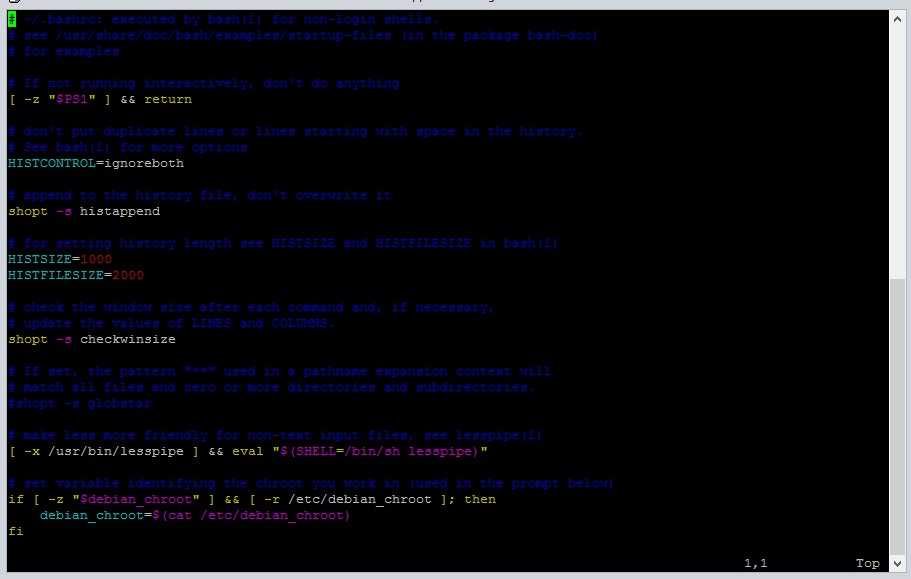
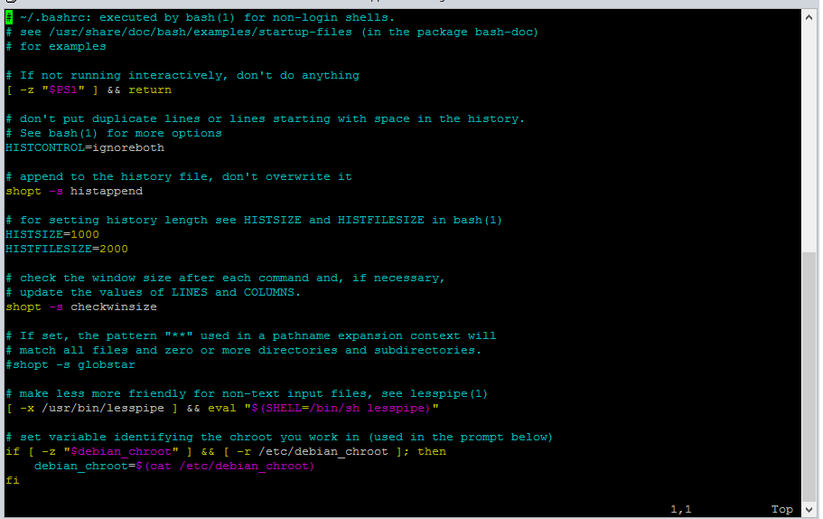

When learning bioinformatics, you will perhaps need to create or edit text files, shell scripts or Python scripts from the command line. Using a Unix-based text editor is also good practice for getting used to the environment if you are new to the command line. I have seen that many people have their preference for [nano](https://en.wikipedia.org/wiki/GNU_nano), [emacs](https://en.wikipedia.org/wiki/Emacs) or [vim](https://en.wikipedia.org/wiki/Vim_(text_editor)). I started with nano, as it is quite straightforward to use - but then I moved to vim (probably because it had lots of colours). 

If you tried using vim, you may have noticed that it's not as straightforward to use. Vim has *modes*, and if you're pressing the wrong keys in the wrong mode you might have found yourself stuck in vim.

At the moment, I know the bare minimum basics of vim - so in this blog post, let's learn some vim together. For a list of the commands I cover, skip to the end of the post.

**Before we start - if keys are pushed and vim won't let you leave, simply hit the `Escape` key and then enter `:q` to quit.**

## Creating a new file

Let's start by creating a little bash script with vim. Move to the directory (with the `cd` command) where you want to make the file, then type:

```bash
vi learn_vim.sh
```

If this file doesn't currently exist, vim will open a new blank file. If it does exist, it will open the file for you to edit; creating a new file and editing an existing one are both done with `vi <filename>`.

Vim will start off in command mode - you can't type anything in. To enter insert mode, press `i`. You can see this down the bottom of the terminal - it says `-- INSERT --`.

In insert mode we can type things in. Let's write a short bash script. Type in the following:

```bash
# A short bash script
for i in `seq 1 5`
do
echo "Vim isn't as hard as it looks"
done
```

Now we want to save this new script, exit vim and run it. 

To leave insert mode, press the `Escape` key. Now we are back in command mode - there's no ``-- INSERT --` at the bottom anymore. To save and quit, type and enter `:wq`. Your command appears down the bottom of the terminal.

Commands in vim start with a colon. `w` means write, as in write the file to disk (save it), and `q` means quit. So we just gave the command, "save this file then exit".

Now we're outside vim and can run the bash script to see how it works. First, we need to make it an executable file so that the computer can read the commands we wrote in it:

```bash
chmod +x learn_vim.sh
```

Then we can try running the script:

```bash
bash learn_vim.sh
```

You should see:

```
Vim isn't as hard as it looks
Vim isn't as hard as it looks
Vim isn't as hard as it looks
Vim isn't as hard as it looks
Vim isn't as hard as it looks
```

Which it isn't! Opening, editing, saving and closing a file is as simple as that.

## Moving around and moving things around

Let's open that file again.

```bash
vi learn_vim.sh
```

To move around within the file (these are not the only ways, but I find simplest):

* Arrow keys to move up and down lines, and one character left and right
* Use the `Home` and `End` keys to jump to the beginning or end of a line
* To jump ahead by words (for example, if you want to edit something in the middle of a long line), `w` will jump forwards, `b` jumps backwards
  + You can also specify how many words to move; e.g. `3w`
* Move to the very beginning of a file with `gg`, or to the end with `G`
* Jump paragraphs with `}` (next) and `{` (previous)

Now let's add some more text to this bash script. After the terminal is done with telling me about vim, I want to run FastQC on some sequencing reads. Let's say they are in the `/RAW/Lappan/totally_real_data/` directory.

In vim, enter insert mode `i`. You can paste text that you have copied from other places into vim (or anywhere on the command line) by **right clicking.** 

```bash
# Copy the text below, then right click in your terminal with vim (in insert mode) to paste it there
for data in /RAW/Lappan/totally_real_data/*.fastq
do
fastqc $data -o fastqc_out
done
```

If you want to copy things from the vim document to elsehwere in the vim document, simply **highlight it** - it copies automatically - then move to the line where you want to paste it and right click. This goes for anything on the terminal; highlight to copy, right click to paste.

Turns out there's not really any data in that directory - I don't want to run FastQC on it anymore. To delete these lines, press `Escape` to go back into command mode and:

* Move to the beginning of a line and use `d$` to delete to the end of a line
  + If at the end of a line, `d0` will delete to the beginning
* Move to the beginning of a line, and use `d)` to delete to the end of the sentence (a bash loop counts as a sentence)
* To delete the rest of the file from where you are, use `dG` (remember `G` was to move to the end) 
* To undo the last operation, like a delete, use `u`. 
  + Control R will redo it.

Or, seeing as I don't need to run FastQC and I like the file how it was in the first place, we can leave vim *without* saving by using `:q!`. Be careful when you type that `!` - be sure you don't need to save because vim won't ask you!

Those commands are what I find most useful to know. There are many more, with a nice list here: https://www.maketecheasier.com/vim-keyboard-shortcuts-cheatsheet/.

## Pretty colours

Something I like about vim is the colours. To get a good idea of what the current colour scheme looks like, let's have a look at a more substantial file that already exists. You should have a file called `.bashrc` in your home directory - we can open it up with the following command. If you don't have a `.bashrc` file, find a Python script `.py` or shell script `.sh` to open.

```bash
vi ~/.bashrc
```



Sometimes, the colours might be difficult to see, like in the image above. To change the colours to the `desert` colour scheme, while you are in vim, enter:

```bash
# Make sure you use the wrong spelling of "colour"
:color desert
```



That looks better!

You can check out some other colours by typing `:color ` (with a space at the end) then pressing tab to cycle through. Yes, there's one called `elflord`.

However, this colour change will only apply to your current vim session - if you leave and open another file, it'll be back to the old colours. Let's quit vim (`:q`) and make this change permanent:

```bash
# Open the vim configuration file to edit it
vi ~/.vimrc
```

This is a configuration file, like your `.bashrc` file, but for vim. In this file, enter insert mode (`i`) and add the line:

```bash
:color desert
```

Then exit insert mode (`Escape`), and save and close the file (`:wq`).

Files opened with vim will now always have that colour scheme. If it hasn't updated, you may need to "refresh" by sourcing that file:

```bash
source ~/.vimrc
```

That's it for now, though there is much more to learn about vim. Here are the commands I covered in this post:

Command | What it does
--- | ---
`vi <filename>` | Open the file in vim
`i` | Enter insert mode
`Escape` | Go back to command mode
`:wq` | Write the file and quit vim
`:w` | Just write the file
`:q` | Just quit the file
`:q!` | Quit the file and discard changes
`:color ` | Cycle through available colour schemes, change colour scheme
**Keyboard shortcuts** | 
Arrow keys | Move up and down lines, and one character left/right
`Home` | Jump to the beginning of a line
`End` | Jump to the end of a line
`w` | Jump forwards by one word
`b` | Jump backwards by one word
`3w` | Jump forwards  by 3 words (replace with any number)
`gg` | Move to the beginning of the file
`G` | Move to the end of the file
`}` | Jump to next paragraph
`{` | Jump to previous paragraph
Highlight text | Copies the text
Right click | Pastes the copied text
`d$` | Delete to the end of the line
`d0` | Delete to the beginning of the line
`d)` | Delete to the end of a sentence (a bash loop counts as a sentence)
`dG` | Delete to the end of the file
`u` | Undo the last operation
Ctrl R | Redo the last operation

If you have any questions or comments, find me on [Twitter](https://twitter.com/RachaelLappan) or [email me](mailto:rachael.lappan@gmail.com)!