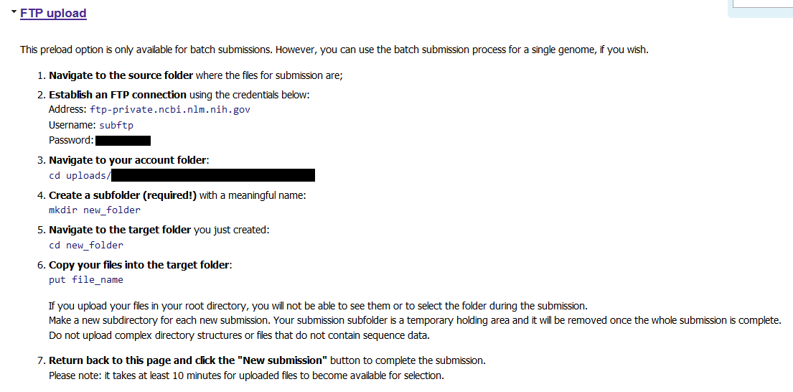
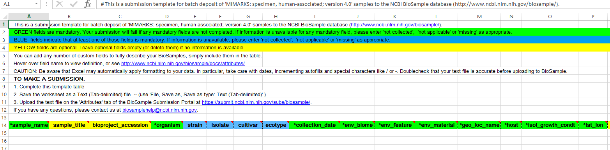
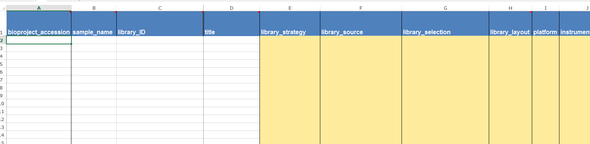

I recently submitted my first manuscript (AHHHHH) and was required to submit our raw sequencing data to an online repository. There were several I could choose from, but I decided to upload to the NCBI [Sequence Read Archive](https://www.ncbi.nlm.nih.gov/sra).

While this was reasonably straightforward and took only a few hours to *do*, I didn't know what to expect until I started submitting and I actually needed a few days to complete the process. So for my first blog post (hello if you're reading!) I thought it might be useful to explain the submission process for my 16S human microbiome data for anyone else who may be doing this for the first time.

## Background reading

I followed the [quick start guide](https://www.ncbi.nlm.nih.gov/sra/docs/submit/), [file upload options](https://www.ncbi.nlm.nih.gov/sra/docs/submitfiles/) and [submission portal guide](https://www.ncbi.nlm.nih.gov/sra/docs/submitspfiles/). These are well written but it can take some time to get your head around exactly what you need to do.

There were two important things brought to my attention by these guides: 

* I had over 1000 individual `.fastq` files so I had to split them up into three submissions. 
* If your samples are derived from people and you don't have consent to make their genomic data publicly available (something you tend not to ask for when you're interested in their microbiome), you *must* ask the SRA to screen your sequence files and remove any human sequences. I did this by sending an email to sra@ncbi.nlm.nih.gov after I had started my first submission, letting them know that I needed this screening for all three submissions that I was about to do.

## Uploading your sequence files

After making an NCBI account, I went to the [SRA submission portal](https://submit.ncbi.nlm.nih.gov/subs/sra/) and logged in to begin my first of three submissions.

The first step is to upload the raw sequence files (`.fastq.gz` in my case). I chose FTP upload because it was the most straightforward for me.



Under this link, you will be provided with a password with which to log in to the FTP server. The directory where you put the files will be your email address followed by some randomised characters.

For my three submissions, I made three directories on our analysis server and split the files between them. I followed these instructions, one submission at a time:

```bash
# Initiate FTP
ftp -i
open ftp-private.ncbi.nlm.nih.gov

# Asks for username
subftp

# Asks for password
#<password provided for me in the SRA submission portal>

# Move to the account folder (XXX part given on SRA submission portal)
cd uploads/rachael.lappan@gmail.com_XXX

# Create subfolder
mkdir 16S_project_submission_1

# Move there
cd 16S_project_submission_1

# Put files there (mput is for multiple files)
mput *.fastq.gz
```

Once the files were uploaded, I clicked "New Submission" in the SRA portal to continue on.

## Completing sample submission

**Sections 1 and 2**

These first two sections were straightforward and require details about you and the submission. For my first submission, I selected "yes" for creating a new BioProject; later when I did the second and third, I entered the BioProject number (PRJNA#) that was emailed to me after completing the first submission. For all submissions, I said "yes" to creating new BioSamples.

I set the release date for each submission for one week ahead, allowing time for the human sequence screen to complete for the whole project (as instructed over email).

At this point, the process will look like this:


**Sections 3 and 4**

These sections are also straightforward and required details about the project and any publications associated with it. I haven't got any yet, but I can associate them with the project later.

**Section 5**

In section 5, I selected that the samples were "Genome, metagenome or marker sequences (MIxS compliant)." This is because my samples were 16S rRNA gene amplicon sequences - and I was about to provide the details that make them MIxS compliant. Beneath this, I then selected "Specimen Marker Sequences" and "human-associated" as this was most appropriate for my project.

**Section 6**

This was the first of two sections where I needed to upload information about the samples. Based on the type of samples I specified in the previous section, I was given a template file to download.

In this file, the *minimum* information required is highlighted in green. While this is the template for human-associated samples, most of the columns were still really only applicable for environmental samples. 



For my samples, the organism name was "human metagenome" (this should be used [even for 16S](https://phylogenomics.blogspot.com.au/2012/08/referring-to-16s-surveys-as.html)) as this is the appropriate category for microbiome samples that come from humans. 

I entered "not applicable" or "not collected" as appropriate some of the mandatory fields, but I tried to fill them out where possible. For `env_material` it gives environmental examples, but I entered things like "nasopharynx" and "ear canal".

The rest of the columns were completely optional (and most didn't apply) but I did add two columns at the end; `sample_type` (important to my study) and `sample_ID`. This is because I was required to have a column with a unique value for each sample; and it can't be `sample_name` (I'm not certain why) so I just copied the sample names to `sample_ID`. 

For the first submission, I left `bioproject_accession` blank but for the remaining two, I entered the PRJNA# I was emailed after I completed the first submission.

This spreadsheet must be saved as a .txt file for uploading. The SRA portal then checks the file for any issues before moving to the next step.

**Section 7**

Having fulfilled the requirements for the BioProject and BioSample records (my understanding is that these are separate entities to SRA itself) I then needed to upload an SRA metadata file. I was again provided with a template, making this step also quite simple. 



Again, I left bioproject accession blank for the first submission but made sure to add it for the other two. I put the sample ID in both `sample_name` and `library_ID` (I'm under the impression that samples and libraries are basically the same thing). For a 16S rRNA gene amplicon study, the appropriate values in the other columns were `AMPLICON`, `METAGENOMIC`, `PCR` and in my case, `paired`, `ILLUMINA` and `Illumina MiSeq`. I had paired end reads, so I put the file names for the `R1` reads in `filename` and the `R2` reads in `filename2`. This one also had to be saved as `.txt` for uploading.

**Sections 8 and 9**

In this section I specified that I pre-uploaded with FTP and point to the directory where I put the files. Then the submission is complete! I received an email pretty quickly with the BioProject number in it.

For the second and third submissions, I used the BioProject number in the metadata files and also set these to be released in a week. It took a couple of days for the human sequence screening to complete; then I received a notification that my submission had been published (they released it as soon as the screening was done). It was a couple more days before I could view the BioProject page on the web.

## Thanks!

Overall, if you have all of your data prepared ahead of time (I used R to create the columns of data I needed for the metadata spreadsheets), you should be able to finish the process in one day and allow perhaps up to a week for everything to be ready for others to view and download.

I hope this is a useful overview of what to expect when submitting 16S rRNA amplicon data to the Sequence Read Archive. If you have any questions or comments, please [email me](mailto:rachael.lappan@gmail.com) or find me on [Twitter](https://twitter.com/RachaelLappan).
