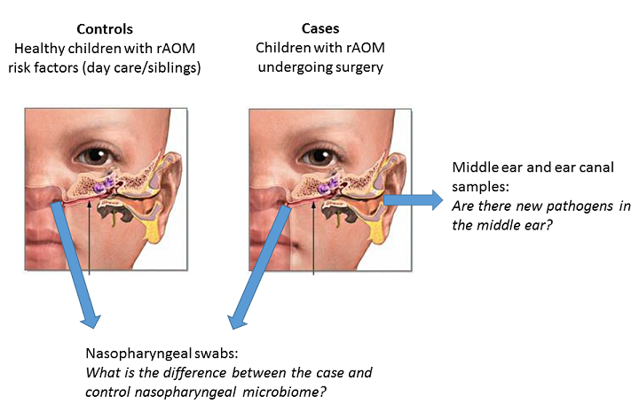
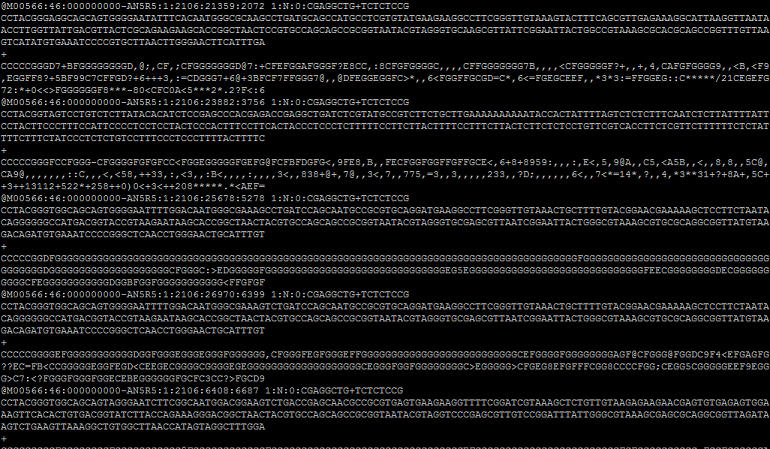
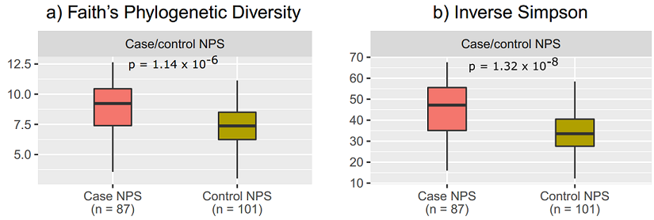
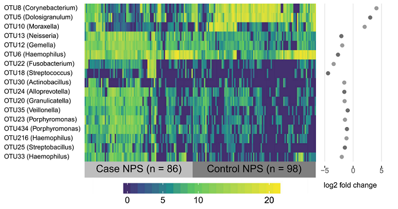
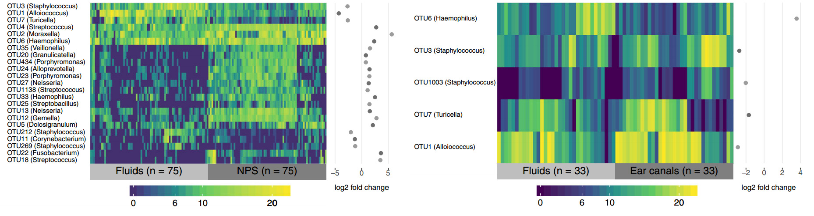

This year is the PhD's final year, so I'm going to become a bit of a hermit and will probably be blogging less.

However, I'm still here and my first manuscript has finally been published!

<blockquote class="twitter-tweet" data-lang="en">
Here it is, my first paper on the <a href="https://twitter.com/hashtag/microbiome?src=hash&amp;ref_src=twsrc%5Etfw">#microbiome</a> of <a href="https://twitter.com/hashtag/otitismedia?src=hash&amp;ref_src=twsrc%5Etfw">#otitismedia</a>! Thanks to the work of <a href="https://twitter.com/ChrisBlyth74?ref_src=twsrc%5Etfw">@ChrisBlyth74</a>, <a href="https://twitter.com/sarrajamieson?ref_src=twsrc%5Etfw">@sarrajamieson</a>, <a href="https://twitter.com/Christo28670247?ref_src=twsrc%5Etfw">@Christo28670247</a> and other great non-Twitter people. <a href="https://twitter.com/hashtag/phdchat?src=hash&amp;ref_src=twsrc%5Etfw">#phdchat</a> <a href="https://t.co/QFjv5llcG1">https://t.co/QFjv5llcG1</a>
&mdash; Rachael Lappan (@RachaelLappan) <a href="https://twitter.com/RachaelLappan/status/965863430262370304?ref_src=twsrc%5Etfw">February 20, 2018</a></blockquote>

It is [available open access](https://bmcmicrobiol.biomedcentral.com/articles/10.1186/s12866-018-1154-3) from BMC Microbiology.

This work is a big chunk of my PhD; it's also a big paper, so I've written this blog post to summarise what it was all about (hopefully in a way that is accessible to all!).

## About the disease and what we aim to do 

We research recurrent ear infections (a disease called recurrent acute otitis media, rAOM) and are looking for novel ways to treat them. Ear infections are most common in young children, and they involve the build up of pus-like fluid behind the eardrum as well as pain, fever and other symptoms of acute (short-lived) infection. Kids are generally diagnosed with rAOM if they've had at least 3 separate ear infections within 6 months, or at least 4 in a year.

Ear infections are known to be caused by three bacterial species (called otopathogens): non-typeable *Haemophilus influenzae*, *Streptococcus pneumoniae* and *Moraxella catarrhalis*. These bacteria can live at the back of the nose without causing disease, but sometimes after a cold or other respiratory viral infection they travel up the Eustachian tube and infect the middle ear.

](../images/eustachian.jpg)

Because the otopathogens are bacteria, the common treatment for an ear infection is antibiotics. This can provide short-term relief for some kids, but these bacteria are becoming resistant to antibiotics. Kids with rAOM continue to get ear infections and end up having surgery to prevent their eardrum from bursting. This situation isn't ideal, and is significantly worse for Australian Indigenous children who experience more severe, earlier onset ear disease. As researchers aim to develop new therapies for rAOM, the goal is to either prevent all ear infections early in life, or to prevent their recurrence in kids prone to rAOM.

## An approach that has been successful before

Probiotic therapy has been quite successful in treating or preventing severe bacterial diseases. Probiotics are 'good' bacteria that provide some benefit when administered. There are several potential mechanisms for this; for example, they may compete with the pathogenic (disease-causing) bacteria for nutrients, or they may secrete some molecules that actively kill the pathogens. In particular, the therapy is very effective when the probiotic bacteria are derived from the healthy microbiome (community of microbes) of the body site where they need to be effective. Some great examples are:

1. [The faecal transplant](http://www.nejm.org/doi/10.1056/NEJMoa1205037): not probiotics *per se*, but essentially a transplant of the entire healthy gut microbiome to override a diseased one - this therapy works with remarkable efficiency against relapsing *Clostridium difficile* disease. This is a chronic intestinal disease that involves the overgrowth of the pathogen *C. difficile*, which is very hard to clear.

2. [A mouse study](http://journals.plos.org/plospathogens/article?id=10.1371/journal.ppat.1002995) demonstrated that a mixture of six bacteria from the gut of healthy mice resolve disease in a *C. difficile* mouse model. Importantly, these bugs had no effect on their own; it was the combination of them that made the treatment.

3. A study on [*Salmonella* in pigs](http://aem.asm.org/content/73/6/1858.full) similarly used probiotic bacteria isolated from the intestines of healthy pigs to significantly reduce the effects of subsequent *Salmonella* infection; demonstrating that probiotics are useful for prevention as well as treatment.

4. A study in humans [on *Staphylococcus aureus* in the nose](https://www.ncbi.nlm.nih.gov/pubmed/20485435) observed that an enzyme made by the commensal *S. epidermidis* inhibits the formation of biofilm (a protective structure) and colonisation by the pathogen *S. aureus*. This is an example where closely related organisms compete, and the commensal species has developed a mechanism for controlling the pathogen.

These studies demonstrate that probiotics can be really successful when the probiotic bugs come from a healthy equivalent of the site where disease is occurring. As rAOM is a disease that involves multiple microbes, we expected that manipulating the microbiome would be a promising way to treat or prevent the disease. Also, some studies have already trialled probiotics for ear infections and they seem to work best when the probiotic bugs come from the upper respiratory tract and are delivered into the nose. This fits with the idea of using 'site-specific' probiotics that were successful in the studies above.

## Our approach

To find the bugs that could be most useful as a probiotic therapy for rAOM, we decided to study the opposite ends of the disease spectrum: we looked at the microbiome of the nasopharynx (back of the nose) in children with rAOM, and compared it to that of children who have never had ear infections despite exposure to the risk factors for rAOM. The goal here was to identify the good bugs in kids that have never had ear infections (but had the opportunity to; so we considered them 'resistant' to rAOM) by comparing them to the bugs found in the kids with rAOM. What we found, we would then investigate further to see if they would be useful as probiotics.

We focused on the nasopharynx to compare the two groups of kids for two reasons:

a) This is where the otopathogens colonise before moving into the middle ear to cause an infection - it's the most likely place where a shift in the bacterial community would be effective.
b) It is the best point of comparison - you can't sample from the middle ear of healthy kids! There's normally no fluid in the middle ear, and it requires surgery to access.

However, it's important that we had the opportunity to sample the middle ear of the kids because we also know that in some kids with rAOM, **none of the otopathogens are detected**. This could mean that there are other bacteria involved in rAOM, so we needed to look at the microbiome of the middle ear as well.

Here's a quick diagram of our basic study design:

So, we had two hypotheses:

1. There are good bacteria in the nasopharynx of our controls that protect them against the disease, and are therefore good candidates for use in probiotics.
2. There are bacterial pathogens other than the known otopathogens in the middle ear of our cases.

and we characterised the microbiome of the middle ear and nasopharynx to address them.

## How we looked at all the bugs

To explore the microbiome, we need to study the DNA of the microorganisms in the samples. While there are methods that allow you to also capture the viruses and fungi in the microbiome, we used a method that focuses on bacteria.

I extracted the total DNA from each of the samples, then used [PCR](https://en.wikipedia.org/wiki/Polymerase_chain_reaction) to make lots of copies of a small region of the 16S rRNA gene. This gene is present in all bacteria, but is not found in other organisms. By having lots of copies of this gene, I have amplified the bacterial DNA in the sample because this is the DNA we are interested in sequencing. We only need this small part of the gene because this is enough to tell us which bacteria the DNA comes from; we don't need to amplify their whole genomes. This DNA is then sequenced, and the data that comes out consists of lots of bacterial sequences:

By comparing these bacterial DNA sequences to the known DNA sequences of bacteria that have been studied before, we can determine which bacteria we have in the sample.

Once I had identified these sequences and calculated the abundance of each bug in each sample, I could start exploring the differences between our cases and controls, and investigating what we've got in the middle ear.

## The interesting stuff that we found

In a nutshell, there was a lot of data here so I was able to look at a lot of things. To summarise:

**1. The nasopharynx of cases was more diverse than that of controls - the nasopharynx of healthy controls is characterised by a less complex bacterial community.**

**2. *Corynebacterium* and *Dolosigranulum* were the two major bugs that were enriched in the control nasopharynx. This addresses our first hypothesis - they are commensal bacteria that are diminished in the nasopharynx of cases!**

**3. *Corynebacterium* and *Dolosigranulum* are correlated with each other - they are found together more often than not.**

**4. *Alloiococcus*, *Turicella* and *Staphylococcus* were the three bugs that were enriched in the middle ear compared to the nasopharynx in the kids with rAOM. They were the most common bugs seen in the middle ear, but they were also the most common in the ear canal.**

## What we think it means

Finding *Corynebacterium* and *Dolosigranulum* in our control samples was the most exciting result from our study, because it shows that these bugs are important parts of the healthy nasopharyngeal microbiome. Their correlation also suggests that both of them may be essential to maintain a healthy state. However, what we don't know is whether the cases have rAOM because they didn't have enough of these bugs (i.e. they are protective) or whether antibiotics and ear infections get rid of these healthy bugs (i.e. they are characteristic of a healthy microbiome, but not involved in protection). This is because we've only looked at one point in time, and so we want to investigate these bugs further to see if they demonstrate a protective role or not.

Finding *Alloiococcus*, *Staphylococcus* and *Turicella* in the middle ear was also an important result. However, because we also saw them in the ear canal it is still unclear whether they just normally live in the ear and are picked up in studies that look there, or if they are actually involved in causing the disease. The ear canal samples were important controls, otherwise we may have been led to believe that these bugs are really important in rAOM - while this would be exciting, it is important to consider that they may not be. *Alloiococcus* and *Turicella* in particular remain a puzzle - for the ~25 years that we've known about them, it's been difficult to determine their role in the ears. What's also interesting is that *Alloiococcus* is most closely related to *Dolosigranulum*, and *Turicella* to *Corynebacterium*! This may be a neat coincidence, but we're still yet to work this one out.

**So there you have it!** If you have any questions or comments about our research or this paper: feel free to leave a comment below, find me on [Twitter](https://twitter.com/RachaelLappan), or [email me](mailto:rachael.lappan@gmail.com) or my supervisor [Chris Peacock](mailto:christopher.peacock@uwa.edu.au). Thanks for reading!